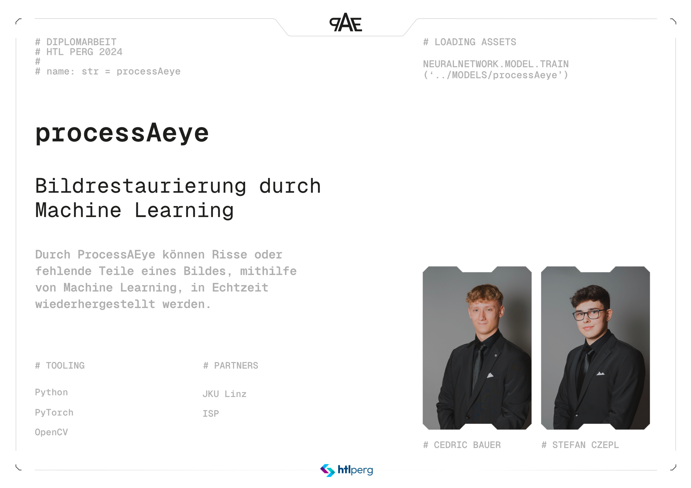

# ProcessAeye: Echtzeit Kamera Inpainting

Die Grundidee von [**ProcessAeye**](https://dspace.htl-perg.ac.at/items/a8b2af86-e560-45d8-b983-512e8ce28cdd) ist es, fehlende oder beschädigte Teile eines Bildes in Echtzeit wiederherzustellen. Ziel ist eine Anwendung, welche Bilder einer Kamera einliest und diese anhand von fehlenden Bereichen wiederherstellt. Diese fehlenden Bereiche werden dabei vom Benutzer festgelegt.

## Hauptkomponenten

Um dieses Ziel zu erreichen, werden drei Hauptkomponenten benötigt:

- **NVIDIA Jetson Nano**: Ein kleiner, leistungsstarker Computer, der speziell für KI-Anwendungen entwickelt wurde. Er ermöglicht es, Bilder durch Machine-Learning-Modelle in Echtzeit zu verarbeiten und wiederherzustellen.

- **Deep Learning Modelle und klassische Bildverarbeitungsalgorithmen**: Durch diese werden die Bilder rekonstruiert. Im Verlauf der Arbeit sind verschiedene Modelle und Algorithmen verglichen worden. Dabei sind die benötigte Zeit pro Wiederherstellungsdurchlauf und die Qualität der Ergebnisse verglichen worden und die besten Ansätze für die Echtzeitwiederherstellung verwendet worden.

- **Grafische Benutzeroberfläche**: Die rekonstruierten Bilder werden zusammen mit dem Ausgangsbild angezeigt. Auf dem Ausgangsbild kann der Benutzer mithilfe eines Zeichenmoduls die fehlenden Teile im Bild markieren. Um den Unterschied zwischen klassischen Algorithmen und Deep Learning Modellen anschaulich darzustellen, kann man zwischen sechs verschiedenen Ansätzen wählen, wobei drei davon klassische Algorithmen sind und drei Machine-Learning-Modelle.


## Ergebnis

Das Ergebnis ist eine Desktopanwendung, welche für den **NVIDIA Jetson Nano** optimiert ist und sechs Ansätze zur Bildwiederherstellung bietet. Dadurch, dass der Benutzer selbst die Maske zeichnen kann, ist die Anwendung optimal zur Veranschaulichung des Unterschieds zwischen klassischen Algorithmen und Deep Learning Modellen.


## Installations Schritte 🛠 ️

## Python Installation

Laden Sie Python >= 3.8.0 herunter.
Folgen Sie den Anweisungen des Installationsassistenten.

### CUDA(Optional)

Installieren Sie [CUDA](https://developer.nvidia.com/cuda-gpus) von NVIDIA, falls Ihre Grafikkarte dies unterstützt. Damit können Sie die Deep Learning Modelle noch schneller verwenden!

### Packages

Installieren Sie die Packages aus der requirements.txt.
Um dies zu tun, führen Sie den folgenden Befehl in Ihrem Terminal oder Ihrer Kommandozeile aus:

```shell
pip install -r requirements.txt
```

### OBS-Studio (Optional)

Installieren Sie OBS-Studio, fall Sie die virtuelle Kamera verwenden wollen.

### Klonen

Klonen Sie sich das Projekt:

```shell
git clone https://gitlab.htl-perg.ac.at/diplomarbeiten/2024/processaeye.git
```


